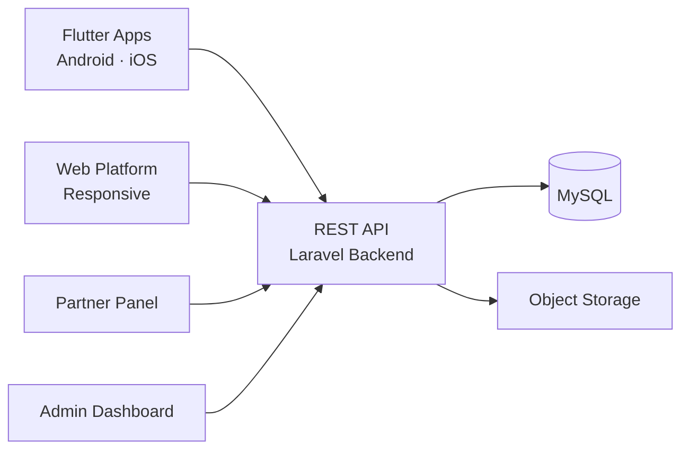

# Etsy Clone — White-Label Solution by Miracuves

---

## Table of Contents

1. [Who Is This For?](#who-is-this-for)
2. [How It Works](#how-it-works)
3. [Core Features](#core-features)
4. [Architecture](#architecture)
5. [Revenue Streams](#revenue-streams)
6. [What's Included](#whats-included)
7. [Deployment Timeline](#deployment-timeline)
8. [Why Not Build From Scratch?](#why-not-build-from-scratch)
9. [Market Opportunity](#market-opportunity)
10. [Client Testimonials](#client-testimonials)
11. [FAQ](#faq)
12. [Resources](#resources)
13. [About Miracuves](#about-miracuves)

## Live Demos

| Environment | URL | What you can test |
|---|---|---|
| Web Platform | [mxbaba.mimeld.com](https://mxbaba.mimeld.com) | Full experience in the browser |
| Mobile App (Android) | [mas.mimeld.com](https://mas.mimeld.com) | Browse, transact, engage |
| Admin Dashboard | [Solution page → Demo](https://miracuves.com/etsy-clone/#demo) | Users, content, plans, analytics |

Demo credentials: [miracuves.com/etsy-clone -> Demo section](https://miracuves.com/etsy-clone/#demo)

## What Makes This Etsy Clone Different

<!-- TODO: fill 3-5 vertical-specific differentiators -->

## Who Is This For?

| Buyer Type | Use Case |
|---|---|
| Marketplace Founders | Launch a marketplace for handmade and artisan goods |
| Craft Communities | Build a dedicated platform for niche creators |
| Agencies | White-label artisan marketplace for clients |

---

## How It Works

1. Seller creates a storefront with products, descriptions, and pricing
2. Customer browses categories or searches for specific items
3. Customer purchases with secure payment processing
4. For physical goods: seller ships with tracking. For digital: instant download
5. Customer receives order and leaves a review
6. Platform collects commission on each sale

---

## Core Features

### Buyer/Client App
- Browse services
- Search & filter
- Book & pay
- Messaging
- Reviews
- Order tracking

### Seller/Provider App
- Profile setup
- Service listing
- Order mgmt
- Earnings dashboard
- Ratings

### Admin Panel
- Category management
- User verification
- Dispute resolution
- Commission analytics
- Promotions

---

## Advanced Features

The platform integrates AI-powered features that reduce manual overhead and capture revenue opportunities:

- **AI Product Recommendation** - Suggests products based on browsing history and purchase patterns
- **AI Visual Search** - Image-based product search for similar items
- **AI Fraud Detection** - Monitors transactions for fraudulent activity
- **AI Matching** - Matches clients with best providers
- **AI Pricing Suggestions** - Optimal pricing recommendations

---

## Apps and Web Panels

| Module | Description |
|---|---|
| Customer App (iOS + Android) | Browse, purchase, review, wishlist |
| Seller Dashboard (Web) | Storefront, listings, orders, analytics |
| Admin Web Panel | Sellers, fees, disputes, analytics |

---

## Architecture

**Stack:**

| Layer | Technology |
|---|---|
| Mobile Apps | Flutter (iOS + Android, single codebase) |
| Web Platform | React.js |
| Backend API | Node.js + Express |
| Database | MongoDB |
| Payments | Stripe, Razorpay, PayPal |
| Notifications | Firebase Cloud Messaging (FCM) |
| Cloud Hosting | AWS / DigitalOcean / Contabo VPS |

---

## Revenue Streams

The platform is engineered to generate revenue from day one through multiple complementary channels:

- **Commission per sale** - take 5-15% from each transaction
- **Listing fees** - flat fee per product listing
- **Featured listings** - sellers pay for placement
- **Subscription plans** - premium seller storefronts with extra features
- Commission per transaction
- Featured listings
- Promoted profiles
- Subscription plans
- Lead generation fees

---

## Security and Compliance

- OTP-based authentication
- SSL/TLS encrypted API communication
- GDPR-ready data handling

---

## What's Included

| Plan | Price | What You Get |
|---|---|---|
| Standard | **$$2,899** | Complete source code, all apps, admin panel, rebranding, 1 year updates |
| Enterprise | Custom Quote | Everything in Standard + custom features, multi-region, priority support |

**What is included:**

- Customer App (iOS + Android)
- Seller Dashboard (Web)
- Admin Web Panel
- Full Source Code
- Complete Rebranding (your logo, colors, app name)
- Server Deployment
- App Store and Google Play Submission Support
- 60 Days Free Bug Support
- Free 1-Year Updates

---
**Pricing:** from **$2,899** — transparent on the [solution page](https://miracuves.com/etsy-clone/#pricing).

## Deployment Timeline

| Day | Milestone |
|---|---|
| Day 1 | Server setup, environment configuration, initial deployment |
| Day 2 | White-labeling - app name, logo, colors, splash screens |
| Day 3 | Payment gateway integration + third-party API configuration |
| Day 4 | Custom feature implementation (if applicable) |
| Day 5 | QA, testing, bug fixes across all panels |
| Day 6 | App Store + Google Play submission + Go-live |

> **Average go-live: 6 business days from payment confirmation.**

---

## Why Not Build From Scratch?

| Factor | Build from Scratch | Miracuves Solution |
|---|---|---|
| Time to Launch | 6-12 months | 6 days |
| Development Cost | $60,000-$150,000 | From $$2,899 |
| Source Code Ownership | Yes | Yes |
| Customization | Full | Full |
| Post-Launch Support | Depends on team | 60 days included |
| Risk | High | Low |

---

## Market Opportunity

| Metric | Data |
|---|---|
| Global Handmade Goods Market (2024) | $700 billion |
| Projected Market Size (2030) | $1.2 trillion |
| CAGR | ~8% |
| Key Growth Markets | USA, UK, Canada, Australia, India |
| Average Artisan Revenue per Year | $50,000-$100,000 |

> Source: Statista, Grand View Research, Allied Market Research

---

## Successful Verticals

- Handmade goods marketplaces (like Etsy, Notonthehighstreet)
- Art and craft supply platforms
- Vintage and antique marketplaces
- Custom-made and personalized goods platforms
- Freelance services
- Home services
- Creative marketplace
- Professional services
- Local services

---

## Client Testimonials

> *"We onboarded 500 artisans in the first month. The storefront customization tools are exactly what creators need."*
> - Founder, Artisan Marketplace

> *"Exceptional results from day one."*
> - Verified Client

> *"Scaled 3x faster than expected."*
> - Startup Founder

---

## FAQ

**How much does an Etsy clone cost?**
A white-label Etsy clone from Miracuves starts at $2,899 with complete source code ownership.

**Can sellers customize their storefronts?**
Yes. Each seller gets a branded storefront with customization options.

**Does it support digital downloads?**
Yes. Digital goods with instant delivery are supported.

**Do I get the source code?**
Yes. Complete source code ownership is included.

**How long does it take to launch?**
6 business days from payment confirmation.

---

## Related Solutions

Explore our other white-label clone solutions:

- [Amazon Clone - Ecommerce Platform](https://github.com/Miracuves-Solutions/Amazon-Clone)
- [eBay Clone - Auction Marketplace](https://github.com/Miracuves-Solutions/eBay-Clone)
- [Shopify Clone - Ecommerce CMS](https://github.com/Miracuves-Solutions/Shopify-Clone)

---

## Resources

- [Full Solution Page](https://miracuves.com/etsy-clone/) — features, pricing, demos, FAQ

## Get Started

**Ready to launch your artisan marketplace platform?**

| Channel | Link |
|---|---|
| Full Solution Page | [miracuves.com/etsy-clone](https://miracuves.com/etsy-clone/) |
| Email | info@miracuves.com |
| WhatsApp | [+91 98300 09649](https://wa.me/919830009649) |
| Book a Call | [Free Consultation](https://miracuves.com/contact/) |

---

## About Miracuves

**Miracuves Solutions Pvt. Ltd.** is a Mumbai-based software company specializing in white-label clone app solutions across 12+ industries.

- 90+ ready-to-deploy solutions
- 6-day delivery guarantee
- 60+ engineers on staff
- 3,900+ apps delivered
- Full source code ownership
- Clients across 40+ countries including India and USA

[Explore all 90+ solutions at miracuves.com](https://miracuves.com)

---

## Disclaimer

This product is independently developed by Miracuves. All product names, logos, and brands are property of their respective owners. Use of these names does not imply endorsement.

---

*(c) 2026 Miracuves Solutions Pvt. Ltd. | Mumbai, India*
*This repository contains product documentation only - no proprietary source code is published here.*

*Keywords: etsy clone, etsy script, white label solution, laravel flutter app, clone script*

---

### Note on This Repository

This repository is a product overview. The full source code is delivered to clients on purchase. For a hands-on evaluation, use the live demos above; credentials are public on the solution page.

<!--
=========================================================
GENERATED FROM MIRACUVES NETFLIX-CLONE README TEMPLATE
Canon: 6 working days, from $2,799 floor, 60 days support + 12 months updates.
Never use 3 days. See https://miracuves.com/facts/ for audited claims.
=========================================================
-->
